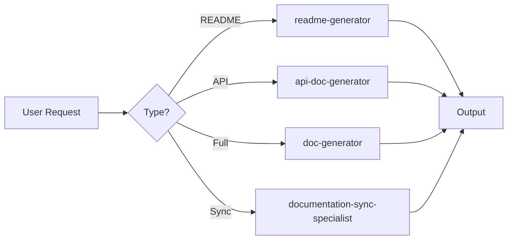

# Documentation Command

Comprehensive documentation generation using specialized skills.

## Available Skills

| Skill | Command | Description |
|-------|---------|-------------|
| **readme-generator** | `/documentation readme` | Generate README.md files |
| **api-doc-generator** | `/documentation api` | Generate API documentation |
| **doc-generator** | `/documentation full` | Full documentation suite |
| **documentation-sync-specialist** | `/documentation sync` | Sync and validate docs |

## Quick Commands

### Generate README
```
/documentation readme [path]
```
Generate professional README for project or specific service.

Examples:
- `/documentation readme` - Generate for root project
- `/documentation readme services/detection-worker` - Generate for service

### Generate API Documentation
```
/documentation api
```
Generate docs/API.md from Express routes with OpenAPI spec.

### Full Documentation Suite
```
/documentation full
```
Generate complete documentation including:
- README.md
- docs/API.md
- docs/USER_GUIDE.md
- docs/CONFIGURATION.md
- CHANGELOG.md

### Sync Documentation
```
/documentation sync
```
Validate and synchronize documentation with code changes.

## Example Tasks

- "Generate README for detection-worker service"
- "Create API documentation from Express routes"
- "Generate user guide for PII configuration"
- "Update changelog with recent commits"
- "Audit documentation for outdated content"
- "Sync all version references to 1.0.0"

## Workflow



## Integration

Documentation skills automatically integrate with:
- **express-api-developer** - Extract API endpoints
- **nats-messaging** - Document NATS subjects
- **docker-expert** - Document container setup
- **git-commit-helper** - Generate changelogs

## Hook Integration

The `doc-update-reminder` hook automatically suggests documentation updates when:
- API routes are modified
- Package configurations change
- Architecture documents are edited

Ready to document!